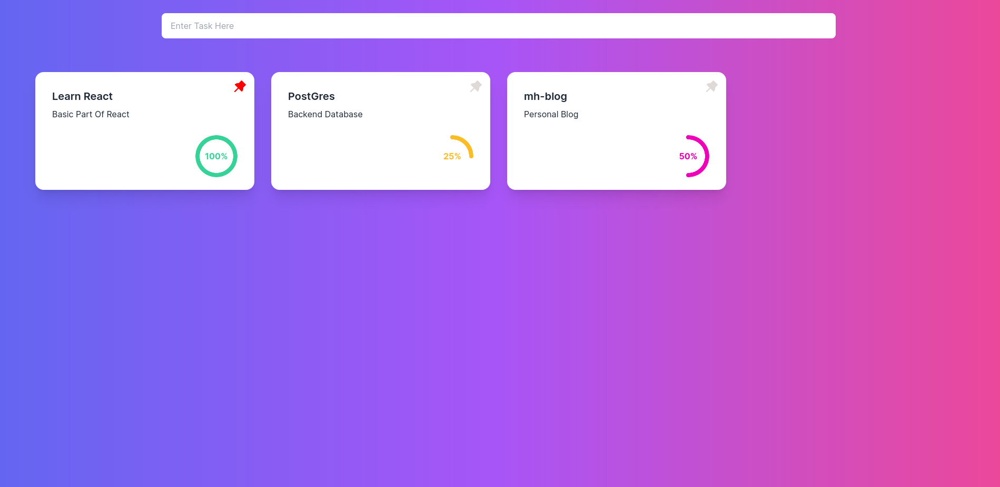

# Task View

View, manage and track task proces with simple view

## Instroduction

First, run the development server:

```bash
npm run dev
# or
yarn dev
# or
pnpm dev
```

Open [http://localhost:3000](http://localhost:3000) with your browser to see the result.

You can start editing the page by modifying `pages/index.js`. The page auto-updates as you edit the file.

## Teachnologies

- Next.js
- React.js
- Tailwind CSS
- DaisyUI

## Screenshots


